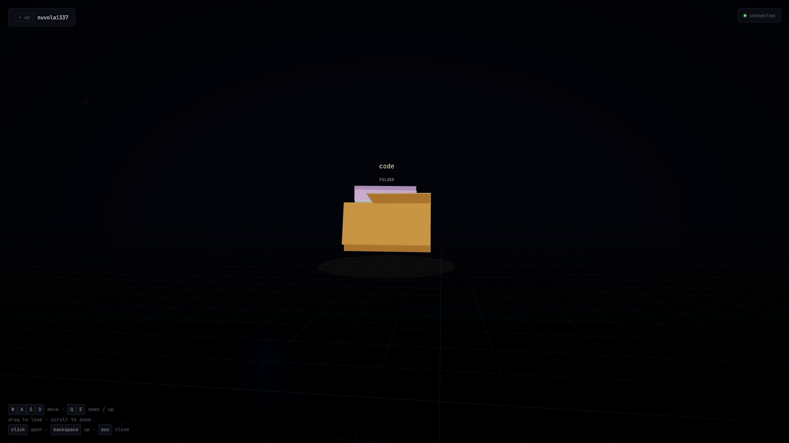

# spatial

A 3D file explorer. Fly through your filesystem with WASD.

Your folders are floating manila folders with paper inside. Files are
cards with real content previews — text files show their first lines,
images render as thumbnails. Everything you see is real. It's reading
your actual disk.

Runs entirely on your machine. Nothing leaves it.

## Run it

    git clone https://github.com/loudified/spatial
    cd spatial
    npm install
    npm start

Open http://localhost:7331 in your browser.

By default it opens your home directory. To use a different root:

    SPATIAL_ROOT=/path/to/folder npm start

## Controls

| Key | Action |
|-----|--------|
| `W` `A` `S` `D` | Move |
| `Q` `E` | Down / up |
| Drag | Look around |
| Scroll | Move forward / back |
| Click | Open a folder or file |
| `Backspace` | Go up one level |
| `Esc` | Close the file viewer |

Hold `Shift` to move faster.

## How it works

Two pieces:

**The server** (Node.js) reads your filesystem and streams folder
contents over a WebSocket. It also serves the client. Every path is
resolved against the root and any attempt to escape it gets clamped
back — the browser can't touch anything outside your home directory.

**The client** (browser) draws the file tree using Three.js. It never
touches the filesystem directly; it just asks the server for listings
and file contents.

Same architecture VS Code uses — a local process that has file access,
and a browser that doesn't.

## Why

Every file explorer is a list. Mine is a place.

## License

MIT
